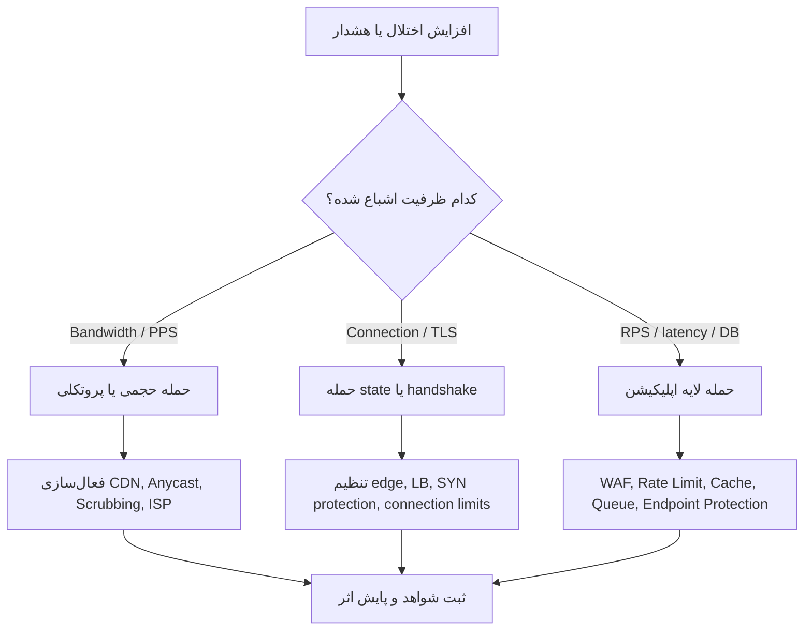
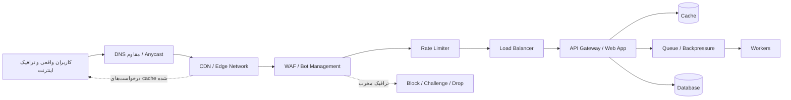

# راهنمای جامع DDoS؛ از شناخت حمله تا معماری مقاوم

> این مقاله با نگاه دفاعی، آموزشی و معماری نوشته شده است. هدف آن کمک به شناخت، تشخیص، کاهش اثر و طراحی سامانه‌های مقاوم در برابر حملات DDoS است؛ نه آموزش اجرای حمله.

## فهرست مطالب

- [خلاصه مدیریتی](#خلاصه-مدیریتی)
- [DDoS چیست؟](#ddos-چیست)
- [انواع حملات DDoS به صورت تئوری](#انواع-حملات-ddos-به-صورت-تئوری)
- [نحوه تشخیص حملات](#نحوه-تشخیص-حملات)
- [روش‌های دفاع و کاهش اثر حمله](#روشهای-دفاع-و-کاهش-اثر-حمله)
- [معماری مقاوم در برابر DDoS](#معماری-مقاوم-در-برابر-ddos)
- [نقش CDN، Rate Limiting و WAF](#نقش-cdn-rate-limiting-و-waf)
- [تحلیل چند حمله معروف تاریخی](#تحلیل-چند-حمله-معروف-تاریخی)
- [چک‌لیست عملیاتی دفاعی](#چکلیست-عملیاتی-دفاعی)
- [واژه‌نامه کوتاه](#واژهنامه-کوتاه)
- [منابع](#منابع)

## خلاصه مدیریتی

DDoS یا «Distributed Denial of Service» حمله‌ای است که هدف اصلی آن از کار انداختن، کند کردن یا بی‌ثبات کردن یک سرویس آنلاین است. در این نوع حمله، ترافیک مخرب یا غیرطبیعی از چندین منبع توزیع‌شده به سمت یک هدف هدایت می‌شود تا ظرفیت شبکه، تجهیزات، سرورها، دیتابیس، کش، صف‌ها یا خود اپلیکیشن را مصرف کند.

نکته مهم این است که DDoS فقط «زیاد شدن ترافیک» نیست. گاهی حمله با حجم بسیار بالا انجام می‌شود، گاهی با تعداد زیاد اتصال، گاهی با درخواست‌های به ظاهر عادی اما پرهزینه، و گاهی با ترکیبی از چند روش همزمان. به همین دلیل دفاع موفق فقط با یک ابزار ممکن نیست؛ باید لایه‌ای، از لبه شبکه تا منطق اپلیکیشن، طراحی شود.

یک دفاع حرفه‌ای سه اصل دارد:

1. **جذب در لبه**: ترافیک بد تا جای ممکن قبل از رسیدن به سرور اصلی حذف یا کنترل شود.
2. **کاهش هزینه هر درخواست**: کش، صف، محدودسازی نرخ، محدودسازی منابع و طراحی سبک endpointها باعث می‌شود حمله اثر کمتری بگذارد.
3. **پایش و واکنش سریع**: بدون baseline، لاگ و runbook، حتی بهترین ابزارها هم دیر فعال می‌شوند یا اشتباه تنظیم می‌شوند.

## DDoS چیست؟

در حمله DoS، یک منبع یا تعداد کمی منبع تلاش می‌کنند سرویس را از دسترس خارج کنند. در DDoS، همان هدف با منابع متعدد و توزیع‌شده دنبال می‌شود؛ مثل دستگاه‌های آلوده، بات‌نت‌ها، سرورهای ابری سوءاستفاده‌شده، پروکسی‌ها یا گاهی زیرساخت‌های باز و اشتباه پیکربندی‌شده.

از نظر امنیت اطلاعات، DDoS مستقیماً ستون **Availability** یا دسترس‌پذیری را هدف می‌گیرد. مهاجم الزاماً نمی‌خواهد داده بدزدد یا نفوذ کند؛ هدف می‌تواند از کار انداختن سرویس، اخاذی، رقابت ناسالم، فشار سیاسی، پوشاندن یک حمله دیگر یا تخریب اعتبار باشد.

### تفاوت ترافیک واقعی و DDoS

گاهی یک کمپین تبلیغاتی، خبر وایرال یا فروش ویژه هم شبیه DDoS دیده می‌شود. تفاوت اصلی در کیفیت و الگوی ترافیک است:

| معیار | رشد واقعی ترافیک | DDoS |
|---|---|---|
| منبع درخواست‌ها | معمولاً با الگوی قابل توضیح | توزیع غیرطبیعی یا متمرکز روی الگوهای مشکوک |
| مسیرهای هدف | صفحات و APIهای منطقی | endpointهای پرهزینه، تکراری یا بی‌ربط |
| نرخ خطا | ممکن است کمی بالا برود | جهش شدید 4xx/5xx، timeout یا reset |
| رفتار کاربر | session، referrer و مسیر طبیعی | رفتار ماشینی، تکراری یا بدون state |
| اثر روی سیستم | فشار قابل مدیریت | اشباع bandwidth، CPU، connection pool، DB یا cache |

## انواع حملات DDoS به صورت تئوری

یک دسته‌بندی رایج، حملات DDoS را در سه گروه اصلی می‌بیند: حجمی، پروتکلی و لایه اپلیکیشن. در عمل، حملات جدی معمولاً چندبرداری هستند و از چند روش همزمان استفاده می‌کنند.

### 1. حملات حجمی؛ Volumetric Attacks

هدف این دسته، پر کردن ظرفیت ارتباطی است؛ یعنی bandwidth، ظرفیت لینک، ظرفیت edge یا ظرفیت دیتاسنتر. در این حالت ممکن است خود اپلیکیشن سالم باشد، اما مسیر رسیدن کاربر به سرویس اشباع شود.

نمونه‌های نظری:

| نوع | هدف | نشانه‌های رایج | دفاع مناسب |
|---|---|---|---|
| UDP Flood | اشباع شبکه و تجهیزات لبه | افزایش شدید bps/pps، ترافیک بی‌state | Anycast، scrubbing، فیلتر در لبه، همکاری ISP |
| ICMP Flood | مصرف ظرفیت شبکه | جهش ترافیک ICMP | فیلتر لبه، محدودسازی، upstream filtering |
| Reflection/Amplification | بزرگ‌نمایی حجم ترافیک با سوءاستفاده از سرویس‌های باز | ترافیک حجیم از منابع ظاهراً معتبر | BCP38، scrubbing، فیلتر upstream |
| DNS Flood | فشار روی DNS authoritative یا resolver | افزایش غیرعادی DNS QPS | DNS Anycast، چند provider، rate limiting روی query |

در حملات amplification، مشکل اصلی فقط قربانی نیست؛ اینترنت پر از سرویس‌های بدپیکربندی‌شده می‌تواند ناخواسته به تقویت‌کننده حمله تبدیل شود. به همین دلیل فیلتر spoofing در سمت شبکه‌ها، که با مفاهیمی مثل BCP38 شناخته می‌شود، برای سلامت کل اینترنت مهم است.

### 2. حملات پروتکلی؛ Protocol / State-Exhaustion Attacks

این حملات به جای تمرکز صرف بر حجم، رفتار پروتکل‌ها یا state نگهداری‌شده در تجهیزات را هدف می‌گیرند؛ مثل جدول connection، session، NAT، load balancer، firewall یا TCP stack.

نمونه‌های نظری:

| نوع | منبع فشار | اثر احتمالی |
|---|---|---|
| SYN Flood | صف اتصال‌های نیمه‌باز | پر شدن backlog یا افت اتصال‌های سالم |
| Connection Exhaustion | تعداد زیاد اتصال همزمان | مصرف memory و file descriptor |
| TLS Handshake Exhaustion | handshakeهای پرهزینه | فشار CPU روی edge یا origin |
| Fragmentation Abuse | پردازش packetهای غیرعادی | فشار روی تجهیزات شبکه و firewall |

دفاع در این لایه معمولاً به تجهیزات edge، load balancer، تنظیمات TCP، SYN cookies، محدودسازی اتصال، offload TLS و scrubbing provider نیاز دارد.

### 3. حملات لایه اپلیکیشن؛ Layer 7 Attacks

در این دسته، درخواست‌ها می‌توانند از نظر شبکه کاملاً عادی به نظر برسند، اما از نظر اپلیکیشن پرهزینه یا غیرطبیعی باشند. این حملات برای سرویس‌های وب، API، لاگین، جست‌وجو، گزارش‌گیری، checkout، upload و endpointهای dynamic خطرناک‌اند.

نمونه‌های نظری:

| نوع | هدف | چرا سخت است؟ |
|---|---|---|
| HTTP GET/POST Flood | افزایش درخواست به مسیرهای حساس | شبیه کاربر واقعی دیده می‌شود |
| Cache-Busting | دور زدن کش با درخواست‌های dynamic | درخواست‌ها به origin می‌رسند |
| Login/API Abuse | فشار روی auth، DB یا rate limit | نیازمند تحلیل هویت و رفتار است |
| Slow Request | نگه داشتن منابع با درخواست‌های کند | حجم کم اما اثر زیاد |
| Expensive Query | endpointهای سنگین مثل search/report | مصرف CPU، DB و queue |

برای این لایه، فقط فایروال شبکه کافی نیست. باید WAF، rate limiting، bot management، احراز هویت، cache strategy، circuit breaker و طراحی درست endpointها کنار هم باشند.

### 4. حملات چندبرداری؛ Multi-Vector

حمله چندبرداری یعنی مهاجم همزمان چند لایه را هدف می‌گیرد؛ مثلاً هم flood حجمی، هم فشار روی TLS، هم درخواست‌های HTTP به مسیرهای پرهزینه. این مدل خطرناک‌تر است چون تیم دفاعی را مجبور می‌کند همزمان شبکه، اپلیکیشن، DNS، دیتابیس و مانیتورینگ را بررسی کند.

اصل دفاعی مهم: **هیچ لایه‌ای نباید تنها نقطه شکست باشد.**

### 5. Ransom DDoS

در Ransom DDoS یا RDDoS، مهاجم معمولاً تهدید می‌کند که اگر پول پرداخت نشود، حمله را شروع یا ادامه می‌دهد. حتی اگر حمله کوتاه باشد، اثر روانی و عملیاتی آن جدی است. پاسخ درست معمولاً شامل فعال‌سازی تیم incident response، آماده‌سازی providerها، جمع‌آوری شواهد، اطلاع‌رسانی داخلی و عدم تصمیم‌گیری عجولانه است.

## نحوه تشخیص حملات

تشخیص خوب از «شناخت رفتار عادی» شروع می‌شود. اگر baseline ندارید، تشخیص حمله به حدس تبدیل می‌شود. baseline یعنی بدانید در ساعت‌ها، روزها، کشورها، endpointها و فصل‌های مختلف چه میزان ترافیک طبیعی است.

### متریک‌های کلیدی

| لایه | متریک | چرا مهم است؟ |
|---|---|---|
| شبکه | bps، pps، dropped packets | تشخیص حملات حجمی |
| TCP/UDP | SYN rate، connection count، reset rate | تشخیص state exhaustion |
| TLS | handshake rate، handshake failure، CPU edge | تشخیص فشار رمزنگاری |
| HTTP | rps، path distribution، status code، latency | تشخیص حملات لایه 7 |
| Cache/CDN | cache hit ratio، origin fetches | تشخیص cache-bypass |
| WAF | blocked/challenged/allowed requests | تحلیل کیفیت فیلتر |
| اپلیکیشن | CPU، memory، thread pool، queue depth | فهم اثر واقعی روی سرویس |
| دیتابیس | slow query، connection pool، lock wait | تشخیص endpointهای پرهزینه |

### نشانه‌های رفتاری

چند نشانه که معمولاً ارزش بررسی دارند:

- افزایش ناگهانی ترافیک بدون دلیل تجاری مشخص.
- تمرکز غیرعادی روی یک endpoint، مثل login، search یا checkout.
- افت شدید cache hit ratio و افزایش origin request.
- افزایش p95 و p99 latency همراه با رشد timeout.
- رشد requestهای بدون session معتبر یا بدون مسیر طبیعی کاربر.
- توزیع غیرعادی user-agent، ASN، کشور، IP reputation یا fingerprint.
- افزایش خطاهای 429، 403، 499، 502، 503 یا 504.
- جهش همزمان CPU اپلیکیشن و queryهای کند دیتابیس.

### تشخیص لایه‌ای

### تفاوت «تشخیص» و «واکنش»

تشخیص یعنی بفهمیم چه اتفاقی افتاده، کجا فشار وارد شده و چه بخشی از سیستم در خطر است. واکنش یعنی تصمیم بگیریم چه چیزی را محدود، cache، challenge، block، degrade یا failover کنیم. اگر این دو قاطی شوند، ممکن است تیم در لحظه بحران قانون‌های عجولانه بنویسد و کاربران واقعی را هم مسدود کند.

## روش‌های دفاع و کاهش اثر حمله

دفاع از DDoS باید قبل از حمله طراحی شود. وقتی لینک اینترنت یا origin کاملاً اشباع شد، فرصت تصمیم‌گیری بسیار کم می‌شود.

### قبل از حمله

| اقدام | نتیجه |
|---|---|
| استفاده از CDN و Anycast | جذب حجم زیاد ترافیک در نقاط مختلف دنیا |
| پنهان و محدود کردن origin | جلوگیری از دور زدن CDN/WAF |
| طراحی cache درست | کاهش درخواست‌های رسیده به origin |
| rate limiting لایه‌ای | کنترل هزینه درخواست‌ها بر اساس IP، کاربر، endpoint و token |
| WAF در حالت monitor سپس enforce | کاهش false positive و آمادگی بهتر |
| ظرفیت‌سنجی و load test دفاعی | شناخت نقطه شکست سیستم |
| runbook و escalation path | کاهش زمان واکنش |
| قرارداد و تماس با ISP/provider | امکان فیلتر upstream یا scrubbing سریع |
| مانیتورینگ و لاگ مرکزی | تشخیص دقیق و تحلیل بعد از حادثه |

### هنگام حمله

اقدام‌ها باید مرحله‌ای باشند:

1. **تشخیص سطح حمله**: شبکه، پروتکل، TLS، HTTP، اپلیکیشن یا دیتابیس.
2. **حفاظت از origin**: مطمئن شوید traffic فقط از مسیر CDN/WAF/load balancer مجاز می‌آید.
3. **کاهش درخواست‌های پرهزینه**: cache بیشتر، غیرفعال کردن موقت مسیرهای غیرضروری، صف‌گذاری و محدودسازی endpointهای سنگین.
4. **اعمال rate limit دقیق**: محدودسازی بر اساس endpoint، هویت، API key، session، IP reputation یا ترکیبی از آن‌ها.
5. **استفاده از challenge**: برای مسیرهای عمومی، challenge یا bot management می‌تواند بار مخرب را کم کند.
6. **فعال‌سازی scrubbing یا upstream mitigation**: مخصوصاً برای حملات حجمی که قبل از رسیدن به شما باید پاک‌سازی شوند.
7. **ارتباطات داخلی و خارجی**: تیم فنی، پشتیبانی، مدیریت و در صورت نیاز کاربران باید پیام هماهنگ داشته باشند.

### بعد از حمله

پس از آرام شدن وضعیت، کار اصلی تمام نشده است:

- timeline دقیق حادثه را ثبت کنید.
- متریک‌های قبل، حین و بعد را مقایسه کنید.
- قانون‌هایی را که عجولانه اضافه شده‌اند بازبینی کنید.
- هزینه زیرساخت و اثر روی SLA را محاسبه کنید.
- endpointهای پرهزینه را اصلاح کنید.
- runbook را با درس‌آموخته‌ها به‌روز کنید.
- اگر حمله با اخاذی یا تهدید همراه بوده، شواهد را حفظ و مسیر قانونی/امنیتی سازمان را دنبال کنید.

## معماری مقاوم در برابر DDoS

معماری مقاوم یعنی قبل از رسیدن حمله به نقطه حساس، چند لایه جذب، فیلتر، کش، محدودسازی و جداسازی داشته باشیم.

### اصول طراحی

| اصل | توضیح |
|---|---|
| Edge-first defense | تصمیم‌های سنگین دفاعی تا حد ممکن در CDN/WAF گرفته شوند، نه داخل origin |
| Origin isolation | سرور اصلی فقط از IPها یا تونل‌های مجاز edge ترافیک بگیرد |
| Cache everything possible | محتوای static و پاسخ‌های قابل cache باید از origin جدا شوند |
| Backpressure | وقتی فشار زیاد شد، سیستم باید کنترل‌شده کند شود، نه ناگهانی فروبپاشد |
| Graceful degradation | قابلیت‌های غیرضروری موقتاً محدود شوند تا قابلیت‌های حیاتی زنده بمانند |
| Multi-region readiness | سرویس‌های حیاتی بتوانند بین regionها یا providerها جابه‌جا شوند |
| DNS resilience | DNS نباید تنها نقطه شکست باشد؛ provider معتبر، Anycast و TTL مناسب مهم است |
| Observability by default | هر لایه باید متریک، لاگ و alert قابل اتکا داشته باشد |

### الگوهای معماری پیشنهادی

| نوع سرویس | معماری مناسب | نکته کلیدی |
|---|---|---|
| سایت محتوایی | CDN + static cache + origin محدود | بیشترین محتوا باید از edge سرو شود |
| SaaS / Dashboard | CDN + WAF + rate limit + API gateway + queue | endpointهای auth و report حساس‌اند |
| API عمومی | WAF/API Gateway + per-key limit + schema validation | فقط IP limit کافی نیست |
| فروشگاه آنلاین | CDN + bot management + checkout protection + queue | checkout و payment باید جداگانه محافظت شوند |
| سرویس realtime/game | provider ضد DDoS شبکه + Anycast/scrubbing + gateway fleet | UDP و latency نیازمند طراحی ویژه‌اند |

## نقش CDN، Rate Limiting و WAF

### CDN؛ جذب در لبه

CDN فقط برای سریع‌تر شدن سایت نیست. در دفاع DDoS، CDN چند نقش مهم دارد:

- توزیع ترافیک روی edgeهای جهانی.
- cache کردن محتوای قابل cache و کاهش فشار origin.
- خاتمه TLS در لبه و کاهش بار رمزنگاری روی origin.
- مخفی کردن origin پشت شبکه CDN.
- فراهم کردن WAF، bot management و ruleهای اضطراری.

اما CDN زمانی خوب عمل می‌کند که درست پیکربندی شود. اگر IP اصلی سرور لو رفته باشد یا origin مستقیم از اینترنت در دسترس باشد، مهاجم می‌تواند CDN را دور بزند. اگر cache key اشتباه طراحی شود، مهاجم با درخواست‌های ظاهراً متفاوت cache را بی‌اثر می‌کند. اگر همه چیز dynamic باشد، CDN به جای سپر، فقط مسیر عبور ترافیک می‌شود.

چک‌لیست CDN:

- origin فقط از مسیر CDN/WAF قابل دسترسی باشد.
- DNS قدیمی، رکوردهای تست، subdomainهای فراموش‌شده و IPهای لو رفته بررسی شوند.
- cache برای assetها، صفحات عمومی و پاسخ‌های امن فعال باشد.
- query stringها و headerهای مؤثر روی cache کنترل شوند.
- origin shield یا لایه کش میانی برای کاهش origin fetch استفاده شود.
- لاگ CDN به سیستم تحلیل مرکزی ارسال شود.

### Rate Limiting؛ کنترل سرعت و هزینه

Rate limiting یعنی محدود کردن تعداد یا هزینه درخواست‌ها در یک بازه زمانی. طراحی خوب rate limit فقط با «هر IP چند درخواست» تمام نمی‌شود. باید بدانیم چه کسی، به کدام endpoint، با چه هزینه‌ای و در چه contextی درخواست می‌دهد.

| مدل محدودسازی | کاربرد | محدودیت |
|---|---|---|
| Per IP | دفاع پایه برای endpointهای عمومی | پشت NAT یا proxy دقیق نیست |
| Per User | کنترل کاربران لاگین‌شده | قبل از login کاربرد محدود دارد |
| Per API Key | APIهای عمومی و partnerها | نیازمند مدیریت کلید و quota |
| Per Endpoint | محافظت از مسیرهای سنگین | نیازمند شناخت هزینه endpoint |
| Global Concurrency | جلوگیری از پر شدن منابع | ممکن است کاربران واقعی را کند کند |
| Cost-based Limit | هر درخواست بر اساس هزینه امتیاز می‌گیرد | پیاده‌سازی پیچیده‌تر است |

الگوی حرفه‌ای این است که endpointهای مختلف وزن متفاوت داشته باشند. مثلاً درخواست health check با درخواست export گزارش یا جست‌وجوی سنگین برابر نیست. همچنین محدودسازی باید پیام خطای واضح، retry-after، و رفتار قابل پیش‌بینی داشته باشد.

### WAF؛ فیلتر هوشمند در لبه اپلیکیشن

WAF یا Web Application Firewall در برابر بسیاری از حملات لایه اپلیکیشن مفید است. در DDoS، WAF می‌تواند:

- درخواست‌های مشکوک را block یا challenge کند.
- قوانین managed برای الگوهای رایج فعال کند.
- endpointهای حساس را با ruleهای اختصاصی محافظت کند.
- بر اساس IP reputation، کشور، ASN، header، path، method یا fingerprint تصمیم بگیرد.
- ruleهای موقت برای بحران اعمال کند.

اما WAF جایگزین معماری خوب نیست. اگر حمله حجمی لینک شما را قبل از WAF اشباع کند، WAF فرصتی برای تصمیم‌گیری ندارد. اگر WAF بدون tuning فعال شود، ممکن است کاربران واقعی را هم بزند. بهترین مسیر معمولاً این است: اول monitor/log، بعد تنظیم و آزمایش، سپس enforce مرحله‌ای.

## تحلیل چند حمله معروف تاریخی

### 1. استونی، 2007؛ DDoS در مقیاس ملی

در سال 2007، وب‌سایت‌های دولتی، بانکی، رسانه‌ای و زیرساختی استونی هدف موجی از حملات سایبری قرار گرفتند. اهمیت این رویداد فقط فنی نبود؛ نشان داد که DDoS می‌تواند به موضوع امنیت ملی، تاب‌آوری دولت دیجیتال و هماهنگی بین بخش خصوصی و عمومی تبدیل شود.

درس‌ها:

- سرویس‌های حیاتی باید برنامه تداوم کسب‌وکار داشته باشند.
- DNS، ارتباطات بانکی، رسانه و دولت نباید به چند نقطه محدود وابسته باشند.
- پاسخ به DDoS فقط کار تیم فنی نیست؛ هماهنگی حقوقی، رسانه‌ای و حاکمیتی هم لازم است.

### 2. Spamhaus، 2013؛ برجسته شدن amplification

در مارس 2013، Spamhaus هدف حمله‌ای بسیار بزرگ قرار گرفت که طبق گزارش Cloudflare و منابع خبری آن زمان، ترافیک مرتبط با آن به حدود 300Gbps رسید. این حمله توجه عمومی را به خطر open resolverها و amplification جلب کرد.

درس‌ها:

- زیرساخت‌های باز و بدپیکربندی‌شده می‌توانند ناخواسته بخشی از حمله شوند.
- دفاع سازمانی کافی نیست؛ hygiene شبکه در سطح اینترنت هم مهم است.
- CDN و شبکه توزیع‌شده می‌توانند فشار را از origin بردارند، اما upstreamها هم باید آماده باشند.

### 3. Mirai، KrebsOnSecurity و Dyn، 2016؛ عصر بات‌نت‌های IoT

در 2016، بات‌نت Mirai با سوءاستفاده از دستگاه‌های IoT ضعیف و بدپیکربندی‌شده، چند رویداد مهم DDoS ایجاد کرد. حمله به KrebsOnSecurity با عدد گزارش‌شده حدود 620Gbps شناخته شد. همان سال، حمله به Dyn، ارائه‌دهنده DNS، باعث اختلال دسترسی به سرویس‌های بزرگی مثل Twitter، Reddit، Spotify، Netflix و چندین سرویس دیگر در بخش‌هایی از اینترنت شد.

درس‌ها:

- دستگاه‌های کوچک و ارزان IoT وقتی زیاد باشند، اثر زیرساختی عظیم دارند.
- حمله به DNS می‌تواند بدون از کار انداختن مستقیم سایت‌ها، دسترسی کاربران را مختل کند.
- وابستگی بیش از حد به یک provider DNS یا یک مسیر resolution، ریسک جدی است.

### 4. GitHub، 2018؛ حمله Memcached با اوج 1.35Tbps

در 28 فوریه 2018، GitHub اعلام کرد که با یک DDoS حجمی بزرگ مواجه شده است. طبق گزارش رسمی GitHub، سرویس GitHub.com از 17:21 تا 17:26 UTC unavailable و تا 17:30 intermittent بود. گزارش‌ها اوج حمله را حدود 1.35Tbps و 126.9Mpps اعلام کردند. GitHub با انتقال ترافیک به Akamai Prolexic توانست اثر حمله را سریع کاهش دهد.

درس‌ها:

- حتی سرویس‌های بزرگ هم برای حملات بسیار حجیم به ظرفیت edge و scrubbing provider نیاز دارند.
- زمان واکنش کوتاه نتیجه آماده‌سازی قبلی است، نه تصمیم لحظه‌ای.
- معماری incident response به اندازه ابزار دفاعی مهم است.

### 5. HTTP/2 Rapid Reset، 2023؛ رکورد در لایه اپلیکیشن

در 2023، Google از حمله HTTP/2 Rapid Reset با اوج بالاتر از 398 میلیون درخواست در ثانیه خبر داد. این نوع رویداد نشان داد که حملات لایه 7 می‌توانند به اعدادی برسند که قبلاً بیشتر در حملات حجمی تصور می‌شد.

درس‌ها:

- حملات لایه اپلیکیشن فقط مسئله چند request اضافه نیستند؛ می‌توانند رکوردهای عظیم بسازند.
- پیاده‌سازی پروتکل‌ها، load balancerها و edgeها باید سریع patch و tune شوند.
- مانیتورینگ RPS، رفتار HTTP/2 و سلامت edge حیاتی است.

### 6. حملات رکوردشکن 2025؛ شدت گرفتن حملات hyper-volumetric

طبق گزارش Cloudflare در Q4 2025، این شرکت در آن سال موجی از حملات بسیار بزرگ را مشاهده و مسدود کرده که یکی از آن‌ها به 31.4Tbps رسیده است. این اعداد نشان می‌دهند که ظرفیت حمله با سرعتی جدی رشد کرده و سازمان‌ها نباید بر اساس تهدیدهای چند سال قبل طراحی کنند.

درس‌ها:

- ظرفیت دفاع باید با روند تهدیدها به‌روز شود.
- حملات کوتاه اما بسیار شدید هم می‌توانند SLA و اعتماد کاربر را تخریب کنند.
- اتکا به یک دیتاسنتر یا یک لینک اینترنتی برای سرویس عمومی پرریسک است.

## چک‌لیست عملیاتی دفاعی

### آمادگی

- [ ] همه دارایی‌های اینترنتی، subdomainها و IPهای عمومی فهرست شده‌اند.
- [ ] origin فقط از مسیر CDN/WAF یا شبکه مجاز قابل دسترسی است.
- [ ] DNS provider مقاوم و ترجیحاً Anycast استفاده می‌شود.
- [ ] cache policy برای محتوای عمومی و static تعریف شده است.
- [ ] endpointهای پرهزینه شناسایی و محدود شده‌اند.
- [ ] rate limit برای IP، user، API key و endpointهای حساس تنظیم شده است.
- [ ] WAF ابتدا در حالت log/monitor آزمایش و سپس enforce شده است.
- [ ] متریک‌های bps، pps، rps، latency، error rate و cache hit ratio alert دارند.
- [ ] runbook حمله DDoS با شماره تماس providerها آماده است.
- [ ] تمرین tabletop یا شبیه‌سازی کنترل‌شده انجام شده است.

### واکنش

- [ ] لایه فشار مشخص شده است: شبکه، پروتکل، TLS، HTTP، اپلیکیشن یا دیتابیس.
- [ ] ruleهای اضطراری با زمان انقضا ثبت شده‌اند.
- [ ] endpointهای غیرضروری یا پرهزینه موقتاً محدود شده‌اند.
- [ ] cache موقت برای مسیرهای امن افزایش یافته است.
- [ ] challenge یا bot management برای مسیرهای عمومی فعال شده است.
- [ ] provider ضد DDoS یا ISP در جریان قرار گرفته است.
- [ ] وضعیت به پشتیبانی، مدیریت و تیم incident response اعلام شده است.

### پس از حادثه

- [ ] timeline دقیق آماده شده است.
- [ ] اثر روی کاربران، SLA و هزینه زیرساخت محاسبه شده است.
- [ ] false positiveها و کاربران آسیب‌دیده بررسی شده‌اند.
- [ ] ruleهای موقت حذف یا دائمی‌سازی اصولی شده‌اند.
- [ ] ضعف‌های معماری اصلاح شده‌اند.
- [ ] runbook و alertها به‌روز شده‌اند.

## واژه‌نامه کوتاه

| واژه | معنی |
|---|---|
| DDoS | حمله توزیع‌شده برای از دسترس خارج کردن سرویس |
| Botnet | شبکه‌ای از دستگاه‌های آلوده یا کنترل‌شده |
| Anycast | انتشار یک سرویس از چند نقطه شبکه با یک آدرس مشترک |
| Scrubbing Center | مرکز پاک‌سازی ترافیک مخرب قبل از رسیدن به مقصد |
| WAF | فایروال مخصوص لایه وب و اپلیکیشن |
| Rate Limiting | محدود کردن نرخ یا هزینه درخواست‌ها |
| BPS | بیت بر ثانیه؛ معیار حجم ترافیک |
| PPS | packet بر ثانیه؛ معیار فشار روی تجهیزات شبکه |
| RPS | request بر ثانیه؛ معیار فشار روی وب/API |
| Origin | سرور اصلی پشت CDN یا reverse proxy |
| Backpressure | کنترل فشار ورودی تا سیستم به شکل ناگهانی فرو نپاشد |

## جمع‌بندی

DDoS یک مسئله تک‌ابزاری نیست. نه CDN به تنهایی کافی است، نه WAF، نه rate limit، نه autoscaling. دفاع حرفه‌ای از ترکیب این‌ها ساخته می‌شود: معماری edge-first، origin پنهان، کش درست، محدودسازی هوشمند، DNS مقاوم، مانیتورینگ دقیق، runbook آماده و تیمی که در زمان بحران بداند چه تصمیمی را کجا بگیرد.

اگر فقط یک جمله از این مقاله به یاد بماند، این باشد:

> بهترین زمان دفاع از DDoS، قبل از شروع حمله است؛ وقتی هنوز فرصت طراحی، تمرین و ساده‌سازی سیستم را دارید.

## منابع

- Cloudflare Learning Center: [What is a DDoS attack?](https://www.cloudflare.com/learning/ddos/what-is-a-ddos-attack/)
- Cloudflare Learning Center: [Famous DDoS attacks](https://www.cloudflare.com/learning/ddos/famous-ddos-attacks/)
- Cloudflare Blog: [The DDoS that almost broke the Internet](https://blog.cloudflare.com/the-ddos-that-almost-broke-the-internet/)
- Cloudflare Blog: [2025 Q4 DDoS threat report](https://blog.cloudflare.com/ddos-threat-report-2025-q4/)
- GitHub Blog: [February 28th DDoS Incident Report](https://github.blog/news-insights/company-news/ddos-incident-report/)
- Google Cloud Blog: [Largest DDoS attack peaking above 398 million rps](https://cloud.google.com/blog/products/identity-security/google-cloud-mitigated-largest-ddos-attack-peaking-above-398-million-rps/)
- Google Cloud Blog: [How HTTP/2 Rapid Reset works](https://cloud.google.com/blog/products/identity-security/how-it-works-the-novel-http2-rapid-reset-ddos-attack)
- AWS Whitepaper: [Best Practices for DDoS Resiliency](https://docs.aws.amazon.com/whitepapers/latest/aws-best-practices-ddos-resiliency/)
- AWS Docs: [Amazon CloudFront and DDoS resiliency](https://docs.aws.amazon.com/whitepapers/latest/aws-best-practices-ddos-resiliency/cloudfront.html)
- OWASP Cheat Sheet Series: [Denial of Service Cheat Sheet](https://cheatsheetseries.owasp.org/cheatsheets/Denial_of_Service_Cheat_Sheet.html)
- NIST: [Advanced DDoS Mitigation Techniques](https://www.nist.gov/programs-projects/advanced-ddos-mitigation-techniques)
- CISA: [Volumetric DDoS Mitigations Guidance](https://www.cisa.gov/sites/default/files/2023-09/TLP%20CLEAR%20-DDOS%20Mitigations%20Guidance_508c.pdf)
- ThousandEyes: [The DDoS Attack on Dyn’s DNS Infrastructure](https://www.thousandeyes.com/blog/dyn-dns-ddos-attack/)
- NATO CCDCOE: [Analysis of the 2007 Cyber Attacks against Estonia](https://ccdcoe.org/library/publications/analysis-of-the-2007-cyber-attacks-against-estonia-from-the-information-warfare-perspective)
