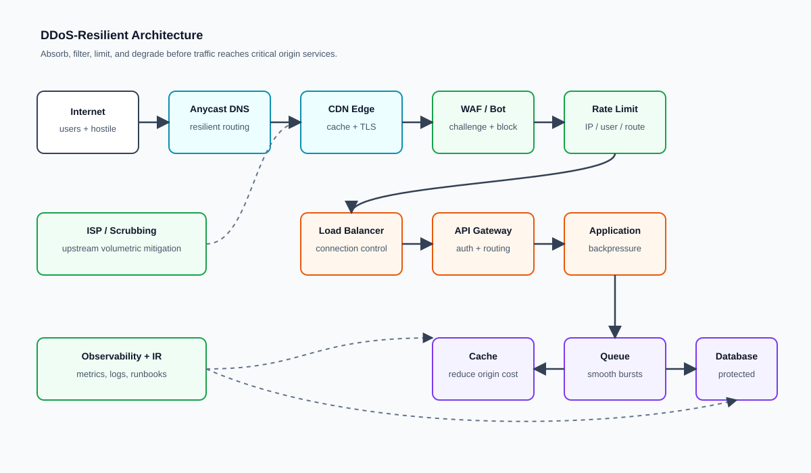
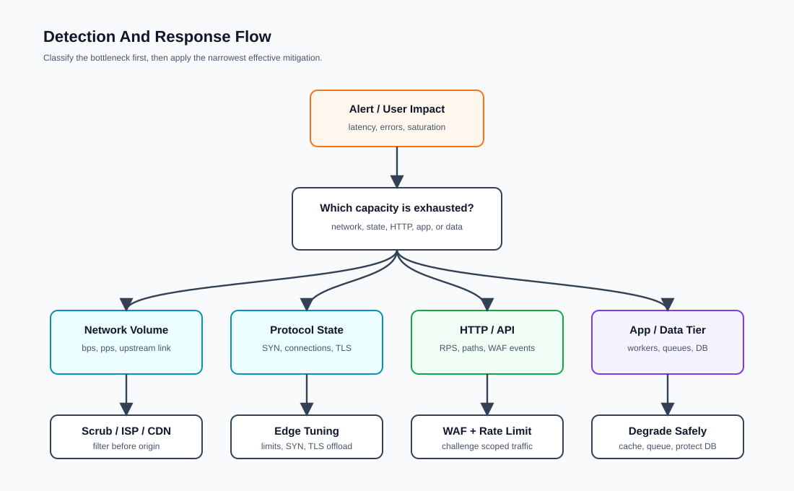
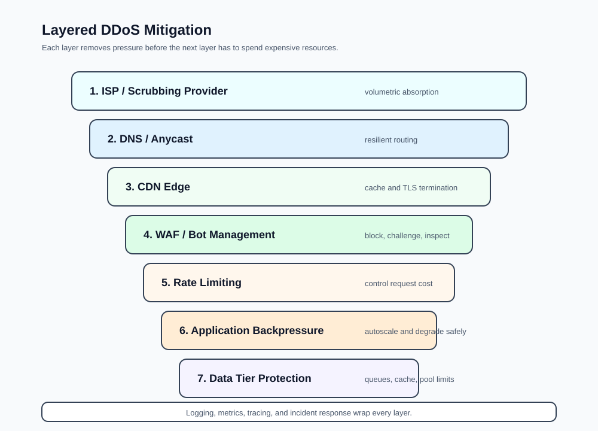

# DDoS Defense Research


> A practical, defensive research repository about Distributed Denial of Service
> attacks: how they work at a high level, how to detect them, and how to design
> systems that keep serving real users under pressure.

Persian version: [README.fa.md](README.fa.md)

## What This Repository Is

This repository is a defensive security reference. It contains architecture
notes, detection checklists, diagrams, case studies, and implementation examples
for DDoS mitigation.

It is not an attack toolkit. There are no traffic generators, exploit scripts,
botnet instructions, or step-by-step offensive procedures here.

## Repository Map

```text
ddos-defense-research
|
|-- README.md
|-- README.fa.md
|-- diagrams
|   |-- ddos-resilient-architecture.svg
|   |-- detection-and-response-flow.svg
|   `-- mitigation-layers.svg
|-- examples
|   |-- nginx
|   |-- nestjs
|   |-- redis
|   `-- cloudflare
|-- lab
|-- case-studies
`-- references
```

## Executive Summary

DDoS is an availability problem before it is a tooling problem. A large attack
can exhaust bandwidth, packet processing capacity, connection tables, TLS
handshake capacity, application workers, queues, caches, databases, or a single
expensive endpoint.

Mature defense is layered:

1. Absorb hostile traffic at the edge before it reaches the origin.
2. Reduce the cost of each request with caching, rate limits, queues, and
   graceful degradation.
3. Detect abnormal behavior quickly with baselines, metrics, logs, and clear
   incident runbooks.

## Architecture At A Glance



The most important architectural rule is simple: do not let the public internet
talk directly to your origin unless that is an explicit and controlled design
choice. For most web systems, origin traffic should pass through DNS, CDN, WAF,
rate limiting, and load balancing layers first.

## DDoS Attack Types, Theoretical View

| Category | Target | Typical pressure point | Defensive focus |
|---|---|---|---|
| Volumetric | Network capacity | Bandwidth, packets per second, upstream links | Anycast, CDN, scrubbing, ISP filtering |
| Protocol / state exhaustion | Network and transport state | TCP backlog, connection tables, TLS CPU | SYN protection, connection limits, TLS offload |
| Application layer | Web/API logic | RPS, workers, database, cache misses | WAF, bot management, rate limits, caching |
| Multi-vector | Several layers at once | Network, edge, app, data tier | Layered defense and incident coordination |
| Ransom DDoS | Business continuity | Availability, trust, operational pressure | Prepared runbooks, provider escalation, evidence handling |

## Detection

Good detection starts with a baseline. If normal traffic is unknown, abnormal
traffic becomes a guess.



### Signals Worth Monitoring

| Layer | Signals |
|---|---|
| Network | bps, pps, dropped packets, upstream saturation |
| TCP/UDP | SYN rate, active connections, reset rate, connection lifetime |
| TLS | handshake rate, failed handshakes, edge CPU |
| HTTP | RPS, status codes, path distribution, p95/p99 latency |
| CDN/cache | cache hit ratio, origin fetches, cache-bypass patterns |
| WAF | allowed, challenged, blocked, false positive rate |
| Application | CPU, memory, thread pool, queue depth, worker saturation |
| Database | connection pool usage, slow queries, lock waits |

### Behavioral Indicators

- Sudden traffic growth without a matching business event.
- Unusual concentration on login, search, report, checkout, or upload routes.
- Lower cache hit ratio with a sharp increase in origin requests.
- High 4xx/5xx rates, timeout growth, or load balancer errors.
- Many requests without valid sessions, normal navigation flow, or stable
  browser fingerprints.
- Suspicious ASN, country, IP reputation, user-agent, or JA3/JA4 distribution.

## Mitigation Layers



| Layer | Defensive purpose |
|---|---|
| ISP / scrubbing provider | Absorb traffic that would saturate your network link |
| DNS / Anycast | Avoid DNS as a single point of failure |
| CDN | Cache public content and terminate traffic near users |
| WAF / bot management | Challenge or block suspicious application traffic |
| Rate limiting | Control request rate and request cost |
| Load balancer / gateway | Enforce connection limits and route traffic safely |
| Application | Apply backpressure, degrade gracefully, protect expensive paths |
| Data tier | Protect database and cache from direct request amplification |
| Observability / incident response | Detect, coordinate, tune, and learn after the event |

## Practical Examples

The examples are intentionally defensive and production-oriented:

- [Nginx rate limiting](examples/nginx/README.md): edge-side request and
  connection controls.
- [NestJS rate limiting](examples/nestjs/README.md): API throttling with
  route-level sensitivity.
- [Redis-based rate limiter](examples/redis/README.md): shared limiter state
  for multi-instance applications.
- [Cloudflare WAF and rate limit rules](examples/cloudflare/README.md): edge
  rules for login, admin, API, and suspicious traffic.
- [Defensive lab](lab/README.md): a safe local layout for studying mitigation
  configuration without targeting any public system.

## Defensive Design Principles

| Principle | Why it matters |
|---|---|
| Origin isolation | Attackers should not bypass CDN/WAF and reach the server directly |
| Cache-first public paths | Static and public content should not consume origin capacity |
| Endpoint-aware limits | Login, export, search, and upload routes need stricter controls |
| Cost-based thinking | A cheap request and an expensive report should not have equal weight |
| Backpressure | The system should slow down predictably instead of collapsing suddenly |
| Graceful degradation | Non-critical features can be reduced to preserve core availability |
| Provider escalation | Large volumetric attacks often require upstream help |
| Post-incident learning | Temporary rules must be reviewed, removed, or made permanent carefully |

## Historical Case Studies

Detailed notes live in [case-studies](case-studies/README.md).

| Case | Why it matters |
|---|---|
| Estonia 2007 | DDoS as a national resilience and coordination problem |
| Spamhaus 2013 | Amplification and open resolver abuse became globally visible |
| Mirai / Dyn 2016 | IoT botnets and DNS dependency risk entered the mainstream |
| GitHub 2018 | A major memcached amplification attack peaked around 1.35 Tbps |
| HTTP/2 Rapid Reset 2023 | Application-layer DDoS reached extreme request-per-second scale |
| Hyper-volumetric attacks 2025 | Defensive capacity must evolve with rapidly growing attack scale |

## Operational Checklist

### Before An Incident

- [ ] Inventory public IPs, DNS records, and forgotten subdomains.
- [ ] Ensure origin servers only accept traffic from approved edge networks.
- [ ] Put public web traffic behind CDN/WAF where appropriate.
- [ ] Define cache policies for static and public content.
- [ ] Add rate limits for login, registration, password reset, search, export,
      checkout, and upload routes.
- [ ] Monitor network, edge, application, cache, and database metrics.
- [ ] Prepare an incident runbook with provider escalation contacts.
- [ ] Test failover, degraded modes, and emergency WAF rules.

### During An Incident

- [ ] Classify the pressure point: network, protocol, TLS, HTTP, app, or data.
- [ ] Protect the origin first.
- [ ] Increase safe caching for public responses.
- [ ] Apply scoped rate limits to expensive or abused endpoints.
- [ ] Use WAF challenges for suspicious traffic instead of broad blocking when
      false positives are likely.
- [ ] Escalate to CDN, DDoS protection, or ISP providers when upstream capacity
      is at risk.
- [ ] Keep a timeline of decisions, rules, metrics, and user impact.

### After An Incident

- [ ] Review false positives and real-user impact.
- [ ] Remove emergency rules that are no longer needed.
- [ ] Convert useful temporary rules into tested permanent controls.
- [ ] Patch architectural weaknesses exposed by the incident.
- [ ] Update the runbook, dashboards, and alert thresholds.

## References

See [references/README.md](references/README.md) for the full source list.

